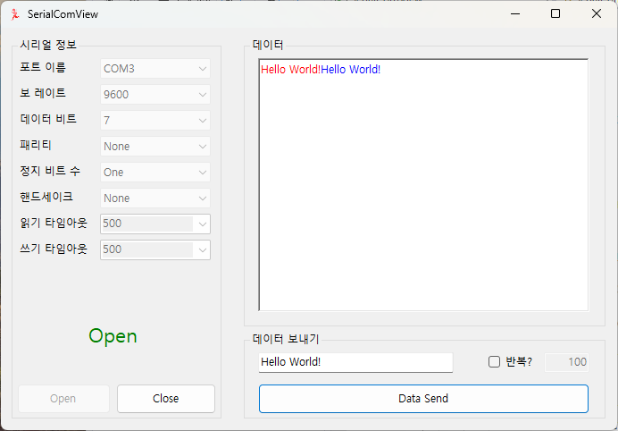
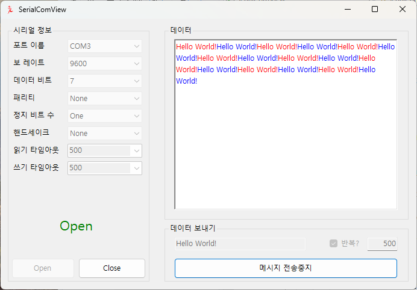

# SerialComView

## **개요**  





`SerialComView`는 C#과 WinForms을 사용해 개발된 **직렬 통신(Serial Communication)** 애플리케이션입니다. 이 프로그램은 다양한 COM 포트 장비와의 통신을 지원하며, 송수신 데이터를 실시간으로 모니터링할 수 있습니다.  

주요 기능:  
- 직렬 포트 설정 (BaudRate, StopBits, Parity 등)  
- 데이터 송수신 모니터링  
- 이벤트 기반 수신(DataReceived) 처리  

---
## **목차**
- [기능](#기능)
- [시작하기](#시작하기)
- [사용법](#사용법)
- [예외 처리](#예외-처리)
- [라이선스](#라이선스)


---

## **기능**
- **직렬 포트 설정**:  
  사용자가 **COM 포트, BaudRate, DataBits, Parity, StopBits** 등의 파라미터를 직접 설정합니다.
- **데이터 송신 및 수신**:  
  입력한 텍스트를 직렬 포트로 송신하고, **실시간 수신 데이터**를 UI에 표시합니다.
- **이벤트 기반 통신**:  
  **DataReceived 이벤트**를 통해 비동기적으로 수신 데이터를 처리합니다.
- **UI 친화적 환경**:  
  간편한 인터페이스로 사용자가 포트 상태를 실시간으로 확인할 수 있습니다.

---

## **시작하기**

### **1. 요구 사항**
- **운영체제**: Windows 10 이상  
- **.NET**: .Net 8.0
- **직렬 포트(COM Port)** 지원 장비 (ex. RS232, RS485, USB to Serial 등) 

### **2. 설치 및 실행**
1. 이 리포지토리를 클론합니다:
   ```bash
   git clone https://github.com/username/SerialComView.git
   cd SerialComView
   ```

2. Visual Studio에서 프로젝트를 열고 빌드합니다.

3. 프로그램을 실행한 후 **COM 포트와 설정 값을 선택**하고, **연결** 버튼을 누릅니다.

---

## **사용법**

1. **포트 설정**:  
   - 프로그램 실행 후 **COM 포트**를 선택합니다.  
   - BaudRate, DataBits, StopBits, Parity, Handshake 등을 필요에 맞게 조정합니다.

2. **데이터 송신**:  
   - 텍스트 박스에 메시지를 입력한 후 **전송(Send)** 버튼을 누릅니다.  
   - 송신된 데이터는 **메시지 박스**에 표시됩니다.

3. **데이터 수신**:  
   - 연결된 장치로부터 데이터가 수신되면, **메시지 박스**에 실시간으로 표시됩니다.


---

## **예외 처리**

- **포트 열기 실패**:  
  - 선택한 포트가 이미 사용 중이거나 잘못된 경우, **예외 메시지**가 표시됩니다.  
	- 다른 포트를 선택하거나, 포트를 점검하세요.
  - 혹은 하드웨어 중 지원하지 않는 매개변수를 설정한 경우, **예외 메시지**가 표시됩니다.
	- 매개변수를 확인하고, 다시 시도하세요.

- **DataReceived 이벤트 충돌**:  
  - UI 업데이트 시 **Invoke()**를 사용해 스레드 충돌을 방지합니다.

---


## **라이선스**
이 프로젝트는 **MIT 라이선스**에 따라 배포됩니다. 자세한 내용은 `LICENSE` 파일을 참조하세요.

---

## **연락처**
프로젝트와 관련된 문의 사항은 아래 이메일로 연락 주세요:

Email✉️: [yhoung11@gmail.com](yhoung11@gmail.com)

---
